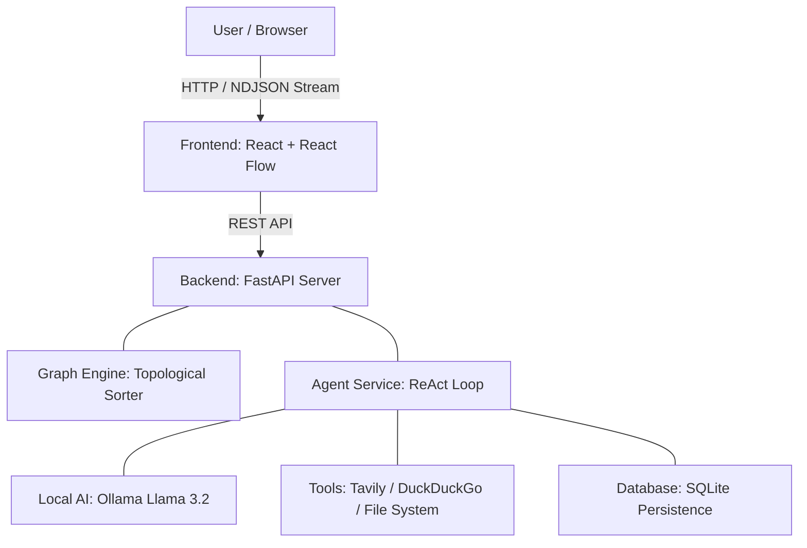

# 📘 Agentic Workflow Automation Platform

### **1. Executive Summary**

The **Agentic Workflow Automation Platform** is a local-first, full-stack AI orchestration engine. It allows users to visually design complex, multi-step automation pipelines where autonomous AI agents collaborate to achieve a goal. Unlike standard chatbots, this system features **directed acyclic graph (DAG) execution**, meaning agents can pass data, context, and files to one another in a structured sequence (e.g., *Researcher Agent* → *Analyst Agent* → *Writer Agent*).

It is built to run entirely on local infrastructure using **Ollama**, ensuring privacy and zero-cost inference, while maintaining the ability to connect to the external internet for real-time data retrieval.

-----

### **2. System Architecture**

The system follows a **Client-Server-AI** architecture, designed for modularity and real-time feedback.



-----

### **3. Technology Stack**

#### **Frontend (The Dashboard)**

  * **Framework:** React 18 + Vite (TypeScript)
  * **Visual Graph Engine:** `@xyflow/react` (formerly React Flow) for drag-and-drop node orchestration.
  * **Styling:** Tailwind CSS (Utility-first styling).
  * **State Management:** Local React State + React Flow Internal Store.
  * **Streaming:** Native `fetch` API with `ReadableStream` reader for NDJSON consumption.

#### **Backend (The Engine)**

  * **Framework:** FastAPI (Python 3.11+) for high-performance async APIs.
  * **Data Validation:** Pydantic V2 for strict schema enforcement.
  * **Database:** SQLite with SQLAlchemy (ORM) for lightweight, file-based persistence.
  * **Graph Logic:** `networkx` (or custom topological sorter) to resolve node dependencies.

#### **AI & Orchestration (The Brain)**

  * **LLM Host:** Ollama (running locally as a system service).
  * **Model:** `llama3.2` (3B Parameter model optimized for speed/latency).
  * **Orchestration:** Custom "ReAct" (Reason + Act) loop implementation (replaced LangChain `AgentExecutor` for granular control).
  * **Tools:**
      * `tavily-python`: Primary search API (Agent-optimized).
      * `duckduckgo-search`: Fallback search API (Privacy-focused, free).
      * `wikipedia`: Third-tier fallback.
      * `pathlib`: Secure local file writing.

-----

### **4. Phase-by-Phase Implementation Log**

This project was built in 5 distinct phases, each adding a layer of complexity.

#### **Phase 1: The Skeleton (Infrastructure)**

  * **Goal:** Establish the communication link between Frontend and Backend.
  * **Delivered:**
      * Set up FastAPI server with CORS middleware.
      * Set up React + Vite project structure.
      * Created dummy endpoints to verify connectivity.
      * **Key Result:** A "Hello World" that proved the stack was viable.

#### **Phase 2: The Core System (Database & Configuration)**

  * **Goal:** Define the data models and stabilize the environment.
  * **Delivered:**
      * Defined `models.py`: Tables for `Workflows`, `Executions`, and `StepResults`.
      * Defined `schemas.py`: Pydantic V2 models for API contracts.
      * **Fixed Critical Bug:** Migrated from Pydantic V1 (`orm_mode`) to V2 (`from_attributes`) to stop server crashes.
      * **Key Result:** A healthy database schema ready to store execution history.

#### **Phase 3: The Agentic Brain (AI Logic)**

  * **Goal:** Create a single agent that can use tools autonomously.
  * **Delivered:**
      * Built `tools.py`: A robust toolbelt containing Web Search (Tavily/DDG) and File Writer.
      * Built `agent_service.py`: A custom **Self-Correcting Execution Loop**.
      * **Innovation:** Implemented a "Safety Net" that catches when the agent *hallucinates* writing a file (by outputting JSON text) and force-executes the tool for it.
      * **Key Result:** An agent that could take the prompt "Research Bitcoin" and actually create a `btc.txt` file on disk.

#### **Phase 4: The Visual Interface (UI/UX)**

  * **Goal:** Allow users to interact with agents via a GUI, not a terminal.
  * **Delivered:**
      * Created `AgentNode.tsx`: A custom React Flow node with "Goal" input and status lights.
      * Implemented **Bi-Directional Sync:** Used `updateNodeData` to ensure text typed in the node was visible to the global graph engine.
      * **Key Result:** Users could configure an agent visually and run it individually.

#### **Phase 5: The Orchestrator (Workflow Engine)**

  * **Goal:** Connect multiple agents into a sequential pipeline (A → B → C).
  * **Delivered:**
      * **Topological Sort:** The backend now calculates the correct execution order based on edge connections.
      * **Context Injection:** The output of Node A (e.g., search results) is automatically injected into the prompt of Node B.
      * **Real-Time Streaming:** Replaced the "Wait and Dump" response with **NDJSON Streaming**. The UI now lights up (Yellow/Green) in real-time as nodes execute.
      * **Drag & Drop:** Implemented HTML5 Drag-and-Drop sidebar to easily add new nodes.
      * **Key Result:** A fully functional "Travel Agent" pipeline where one node finds hotels, and the next node writes an itinerary based on those specific hotels.

-----

### **5. Key Engineering Mechanisms**

#### **A. The Self-Correcting Loop**

We discovered that small models (Llama 3.2) often "forget" to call tools or "lie" about finishing tasks. We engineered a strict loop to counter this:

1.  **Check:** Did the user ask to "save" a file?
2.  **Verify:** Did the agent actually call `file_writer`?
3.  **Kick:** If No, the system injects a `SYSTEM ALERT` into the chat history: *"You claimed to be done, but you didn't write the file. Do it now."*
4.  **Result:** The agent apologizes and executes the tool.

#### **B. The "Tolerant" Tool Handler**

LLMs often hallucinate argument names (e.g., passing `data` instead of `content` to a file writer).

  * **Solution:** Our `file_writer` tool accepts `**kwargs` and checks multiple keys (`content`, `text`, `body`, `data`) to find the payload. It is crash-proof.

#### **C. Context Propagation**

To prevent "Telephone Game" data loss between nodes:

  * We capture the **Raw Search History** from Node 1.
  * We pass this Raw History explicitly to Node 2's system prompt.
  * This ensures Node 2 has the *source facts*, not just Node 1's summary.

-----

### **6. Installation & Setup Guide**

**Prerequisites:**

  * **Node.js** (v18+)
  * **Python** (v3.11+)
  * **Ollama** (installed & running)

**Step 1: Database & Backend**

```bash
cd backend
# Activate virtual environment
source venv/bin/activate  # or `conda activate pyqt-env`
# Install dependencies
pip install -r requirements.txt
# Start Server
uvicorn app.main:app --reload --port 8000
```

**Step 2: Frontend**

```bash
cd frontend
# Install packages
npm install
# Start Dev Server
npm run dev
```

**Step 3: AI Model**

```bash
# Pull the optimized model
ollama pull llama3.1
# Ensure service is running
ollama serve
```

**Step 4: Configuration**
Create a `.env` file in `backend/`:

```env
TAVILY_API_KEY="tvly-..."  # Optional, falls back to DDG if missing
```

-----

### **7. How to Use**

1.  Open `http://localhost:5173`.
2.  **Drag** "Agent Node" from the sidebar onto the canvas.
3.  **Type** a goal (e.g., "Find the latest stock price of Nvidia").
4.  **Drag** a second node.
5.  **Type** a dependent goal (e.g., "Write a poem about that price").
6.  **Connect** the handles (Right of Node 1 to Left of Node 2).
7.  Click **Run Workflow**.
8.  Watch the nodes turn **Yellow** (Running) then **Green** (Success).
9.  Check `backend/data/` for the generated files.

-----

APIs
- `GET /health` - health check
- `POST /workflow/` - create a workflow (dummy)
- `POST /workflow/run/{id}` - start a workflow (dummy)
- `POST /documents/upload` - upload files
- `GET /search?q=...` - dummy search

Next steps
- Implement persistence, PGVector integration, embeddings, and local LLM adapter.
- Improve frontend editor and wire endpoints.
